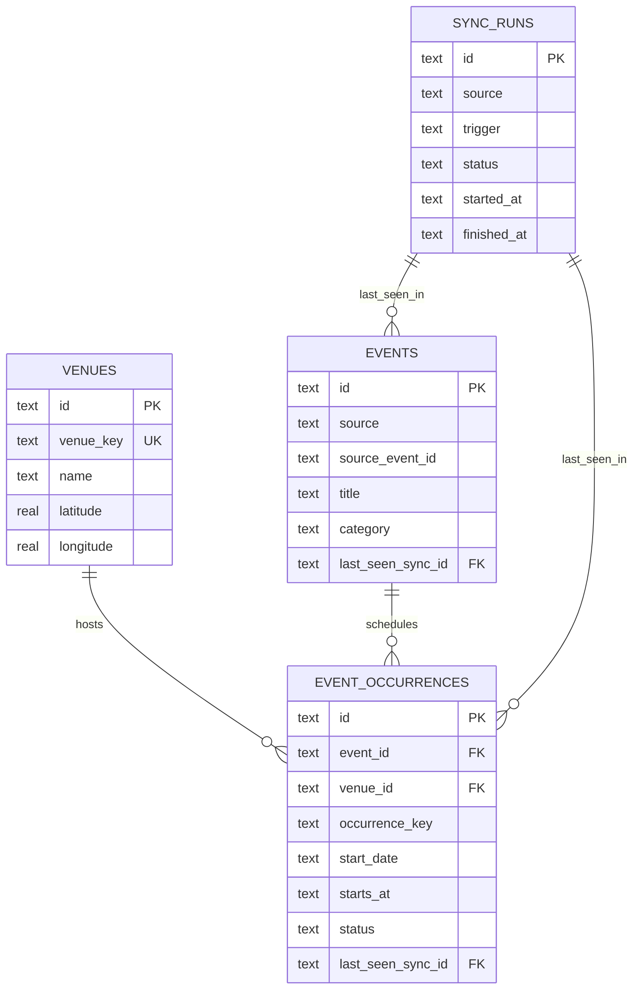

# NearNow D1 Data Model

Status: V1 design baseline  
Last updated: 2026-07-29  
Database: Cloudflare D1 (SQLite-compatible)  
Application time zone: `Europe/Madrid`

## 1. Purpose

NearNow currently downloads and parses the Barcelona Cultural Agenda CSV when
`/api/events` is requested. This makes page availability depend on the upstream
feed being reachable at request time.

The V1 data model introduces a durable D1-backed event catalogue with the
following data flow:

```text
Scheduled collection
        ↓
Download, parse, normalize, and validate
        ↓
Write a successful snapshot to D1
        ↓
/api/events reads D1
        ↓
The page renders stable event data
```

The defining reliability rule is:

> A failed collection must not delete or deactivate the last successfully
> collected event data.

## 2. Scope

V1 contains exactly four product tables:

- `venues`
- `events`
- `event_occurrences`
- `sync_runs`

V1 does not store:

- users or accounts;
- favorites, which remain in browser `localStorage`;
- recommendation or interaction history;
- ticket purchases;
- multiple cities or multiple event sources;
- raw CSV files;
- images or other binary assets.

## 3. Design principles

### 3.1 Events and occurrences are separate

An event represents the durable identity and descriptive information for a
listing. An occurrence represents one scheduled performance of that event.

This allows a future source row to describe more than one date without
duplicating the event title, description, source URL, and category.

### 3.2 Source identity and internal identity are separate

Barcelona's `register_id` is stored as `source_event_id`. NearNow also assigns
its own stable text primary key.

Internal IDs must be generated deterministically before writing to D1. Repeating
the same synchronization should therefore update the same records rather than
create duplicates.

Suggested ID forms:

```text
event:      evt_bcn_<source_event_id>
venue:      ven_<hash_of_venue_key>
occurrence: occ_<hash_of_source_event_id_and_occurrence_key>
sync run:   UUID
```

The exact hash implementation is an application concern, but it must be stable
and covered by tests.

### 3.3 Unknown values remain unknown

The importer must not turn a missing price or time into a confirmed value.

- Missing prices use `price_type = 'unknown'`.
- Missing times use a `NULL` `start_time` and `starts_at`.
- `start_date` remains available for filtering and grouping.
- `time_label` may display `Time TBC`.

### 3.4 Synchronization is idempotent

Running the same input twice must not create additional venues, events, or
occurrences.

### 3.5 Deactivation requires a successful complete feed

Records missing from a failed or suspicious synchronization remain active.
Only a fully downloaded, parsed, and validated synchronization may mark unseen
future occurrences as removed.

## 4. Entity relationship diagram



The venue relationship is attached to `event_occurrences`, rather than
`events`, so different performances of one event may eventually occur at
different venues.

## 5. Shared conventions

### 5.1 D1 types

The logical application types map to D1 as follows:

| Logical type | D1 storage type | Convention |
|---|---|---|
| ID | `TEXT` | Stable application-generated identifier |
| String | `TEXT` | UTF-8 text |
| Boolean | `INTEGER` | `0` is false, `1` is true |
| Decimal money | `INTEGER` | Minor currency units, such as euro cents |
| Coordinate | `REAL` | Decimal latitude or longitude |
| Date | `TEXT` | `YYYY-MM-DD` |
| Time | `TEXT` | `HH:mm` in `Europe/Madrid` |
| Timestamp | `TEXT` | ISO 8601 with an explicit offset or UTC `Z` |
| Enum | `TEXT` | Restricted by a `CHECK` constraint |

### 5.2 Timestamps

System timestamps such as `created_at`, `updated_at`, `started_at`, and
`finished_at` are stored in UTC.

Event dates and times represent Barcelona local time. When a precise event time
is known:

- `start_date` stores its Barcelona calendar date;
- `start_time` stores its Barcelona wall-clock time;
- `starts_at` stores the corresponding ISO 8601 timestamp with offset.

The importer must derive the correct daylight-saving offset for the event date.
It must not assume `+02:00` throughout the year.

### 5.3 Source name

The canonical source value for the initial importer is:

```text
barcelona_cultural_agenda
```

This value is used consistently in `events` and `sync_runs`.

### 5.4 Category values

V1 preserves the categories consumed by the current page:

```text
Concert
Bar
Jam
Classical
Electronic
```

Category classification is performed by the importer. It is not inferred by
SQL queries.

## 6. Table specifications

### 6.1 `venues`

Stores normalized performance locations.

| Column | D1 type | Null | Default | Description |
|---|---|---:|---|---|
| `id` | `TEXT` | No | — | Stable NearNow venue ID |
| `venue_key` | `TEXT` | No | — | Deterministic normalized identity key |
| `name` | `TEXT` | No | — | Display name after verified metadata overrides |
| `address` | `TEXT` | Yes | `NULL` | Human-readable street address |
| `neighborhood` | `TEXT` | Yes | `NULL` | Barcelona neighborhood |
| `district` | `TEXT` | Yes | `NULL` | Barcelona district |
| `latitude` | `REAL` | Yes | `NULL` | WGS84 latitude |
| `longitude` | `REAL` | Yes | `NULL` | WGS84 longitude |
| `created_at` | `TEXT` | No | current UTC time | First insertion time |
| `updated_at` | `TEXT` | No | current UTC time | Last content update |

Constraints:

```text
PRIMARY KEY (id)
UNIQUE (venue_key)
latitude  IS NULL OR latitude  BETWEEN -90  AND 90
longitude IS NULL OR longitude BETWEEN -180 AND 180
```

Venue identity:

1. Apply verified venue metadata first.
2. Normalize Unicode, case, whitespace, punctuation, and street formatting.
3. Build `venue_key` from normalized name plus the strongest available location:
   address first, otherwise rounded coordinates.
4. Do not merge two same-named venues when their known addresses or coordinates
   conflict.

Indexes:

```text
UNIQUE INDEX venues_venue_key_uq (venue_key)
INDEX venues_neighborhood_idx (neighborhood)
```

### 6.2 `events`

Stores source identity and descriptive event information.

| Column | D1 type | Null | Default | Description |
|---|---|---:|---|---|
| `id` | `TEXT` | No | — | Stable NearNow event ID |
| `source` | `TEXT` | No | — | Canonical source name |
| `source_event_id` | `TEXT` | No | — | Cleaned Barcelona `register_id` |
| `title` | `TEXT` | No | — | Cleaned event title |
| `description` | `TEXT` | Yes | `NULL` | Source or verified description |
| `category` | `TEXT` | No | `Concert` | NearNow category |
| `source_url` | `TEXT` | No | — | Original or verified event URL |
| `first_seen_sync_id` | `TEXT` | Yes | `NULL` | First successful run that observed it |
| `last_seen_sync_id` | `TEXT` | Yes | `NULL` | Latest successful run that observed it |
| `created_at` | `TEXT` | No | current UTC time | First insertion time |
| `updated_at` | `TEXT` | No | current UTC time | Last content update |

Constraints:

```text
PRIMARY KEY (id)
UNIQUE (source, source_event_id)
category IN ('Concert', 'Bar', 'Jam', 'Classical', 'Electronic')
first_seen_sync_id REFERENCES sync_runs(id) ON DELETE SET NULL
last_seen_sync_id  REFERENCES sync_runs(id) ON DELETE SET NULL
```

Indexes:

```text
UNIQUE INDEX events_source_identity_uq (source, source_event_id)
INDEX events_category_idx (category)
INDEX events_last_seen_sync_idx (last_seen_sync_id)
```

Update behavior:

- `source`, `source_event_id`, `id`, and `created_at` are immutable.
- Title, description, category, and source URL may be updated by later
  successful synchronizations.
- Verified metadata overrides source data before the event is written.
- Events are not automatically deleted in V1.

### 6.3 `event_occurrences`

Stores a dated performance and its venue, time, price, and availability.

| Column | D1 type | Null | Default | Description |
|---|---|---:|---|---|
| `id` | `TEXT` | No | — | Stable NearNow occurrence ID |
| `event_id` | `TEXT` | No | — | Parent event |
| `venue_id` | `TEXT` | Yes | `NULL` | Performance venue |
| `occurrence_key` | `TEXT` | No | — | Stable identity within the parent event |
| `start_date` | `TEXT` | No | — | Barcelona date, `YYYY-MM-DD` |
| `start_time` | `TEXT` | Yes | `NULL` | Confirmed Barcelona time, `HH:mm` |
| `starts_at` | `TEXT` | Yes | `NULL` | Exact ISO 8601 start timestamp |
| `end_date` | `TEXT` | Yes | `NULL` | Source end date when meaningful |
| `ends_at` | `TEXT` | Yes | `NULL` | Exact end timestamp when known |
| `time_label` | `TEXT` | No | `Time TBC` | User-facing time label |
| `price_type` | `TEXT` | No | `unknown` | Price classification |
| `price_min_cents` | `INTEGER` | Yes | `NULL` | Minimum known price in euro cents |
| `price_label` | `TEXT` | No | `Check price` | User-facing price text |
| `status` | `TEXT` | No | `active` | Current source availability |
| `first_seen_sync_id` | `TEXT` | Yes | `NULL` | First successful run that observed it |
| `last_seen_sync_id` | `TEXT` | Yes | `NULL` | Latest successful run that observed it |
| `created_at` | `TEXT` | No | current UTC time | First insertion time |
| `updated_at` | `TEXT` | No | current UTC time | Last content update |

Constraints:

```text
PRIMARY KEY (id)
UNIQUE (event_id, occurrence_key)
event_id REFERENCES events(id)
venue_id REFERENCES venues(id) ON DELETE SET NULL
first_seen_sync_id REFERENCES sync_runs(id) ON DELETE SET NULL
last_seen_sync_id  REFERENCES sync_runs(id) ON DELETE SET NULL
price_type IN ('free', 'paid', 'donation', 'unknown')
status IN ('active', 'removed', 'cancelled')
price_min_cents IS NULL OR price_min_cents >= 0
```

`occurrence_key` derivation:

- Prefer a stable source occurrence ID if one becomes available.
- Otherwise derive it from the source event ID and source start date.
- Add a source-provided sequence or time only when needed to distinguish
  multiple occurrences on the same date.
- A corrected time must update the existing occurrence, not create a new one.

Indexes:

```text
UNIQUE INDEX occurrences_event_key_uq (event_id, occurrence_key)
INDEX occurrences_active_date_idx (status, start_date)
INDEX occurrences_event_date_idx (event_id, start_date)
INDEX occurrences_venue_date_idx (venue_id, start_date)
INDEX occurrences_last_seen_sync_idx (last_seen_sync_id)
```

Status behavior:

- `active`: present in the latest trusted feed.
- `removed`: absent from a later successful complete feed.
- `cancelled`: explicitly reported as cancelled by a source; the initial source
  may not provide this signal.

Only future occurrences are candidates for automatic `removed` status. Past
occurrences remain historical records.

### 6.4 `sync_runs`

Stores the lifecycle and result of each collection attempt.

| Column | D1 type | Null | Default | Description |
|---|---|---:|---|---|
| `id` | `TEXT` | No | — | UUID generated at run start |
| `source` | `TEXT` | No | — | Canonical source name |
| `trigger` | `TEXT` | No | — | How the run started |
| `status` | `TEXT` | No | `running` | Run state |
| `started_at` | `TEXT` | No | current UTC time | Start timestamp |
| `finished_at` | `TEXT` | Yes | `NULL` | Completion timestamp |
| `source_fetched_at` | `TEXT` | Yes | `NULL` | Time the remote response was received |
| `source_http_status` | `INTEGER` | Yes | `NULL` | Upstream HTTP status, when available |
| `fetched_rows` | `INTEGER` | No | `0` | Parsed source row count |
| `accepted_events` | `INTEGER` | No | `0` | Valid music events accepted |
| `accepted_occurrences` | `INTEGER` | No | `0` | Valid occurrences accepted |
| `rejected_rows` | `INTEGER` | No | `0` | Rows rejected during validation |
| `error_code` | `TEXT` | Yes | `NULL` | Stable machine-readable failure code |
| `error_message` | `TEXT` | Yes | `NULL` | Sanitized diagnostic message |

Constraints:

```text
PRIMARY KEY (id)
trigger IN ('scheduled', 'manual', 'deployment')
status IN ('running', 'success', 'failed')
all count fields >= 0
status = 'running' OR finished_at IS NOT NULL
status != 'failed' OR error_code IS NOT NULL
```

Indexes:

```text
INDEX sync_runs_source_started_idx (source, started_at DESC)
INDEX sync_runs_source_status_started_idx (source, status, started_at DESC)
```

Error messages must not contain credentials, authorization headers, raw
personal data, or complete upstream payloads.

Suggested error codes:

```text
SOURCE_NETWORK_ERROR
SOURCE_HTTP_ERROR
SOURCE_DECODE_ERROR
SOURCE_PARSE_ERROR
SOURCE_VALIDATION_ERROR
DATABASE_WRITE_ERROR
UNEXPECTED_ERROR
```

## 7. Import mapping

Initial Barcelona CSV fields map as follows:

| Barcelona field | NearNow destination |
|---|---|
| `register_id` | `events.source_event_id` |
| `name` | `events.title` |
| `values_description` | Input for `events.description` when suitable |
| `institution_name` | `venues.name` |
| address components | `venues.address` |
| `addresses_neighborhood_name` | `venues.neighborhood` |
| `addresses_district_name` | `venues.district` |
| `geo_epgs_4326_lat` | `venues.latitude` |
| `geo_epgs_4326_lon` | `venues.longitude` |
| `start_date` | `event_occurrences.start_date` |
| `end_date` | `event_occurrences.end_date` |
| verified time metadata | `start_time`, `starts_at`, `time_label` |
| verified price metadata | price fields |
| derived detail URL | `events.source_url` |
| keyword classification | `events.category` |

Verified metadata remains an importer concern. It overrides source fields before
normalization and persistence.

## 8. Synchronization lifecycle

### 8.1 Start

Create a `sync_runs` record:

```text
status     = running
trigger    = scheduled | manual | deployment
started_at = current UTC time
```

### 8.2 Fetch, parse, and validate before product writes

The importer must complete these steps before modifying venues, events, or
occurrences:

1. Download the complete source response.
2. Confirm a successful HTTP status.
3. Decode UTF-16LE and remove the byte-order mark.
4. Parse the CSV.
5. Confirm required columns are present.
6. Normalize IDs, titles, coordinates, dates, venues, and metadata.
7. Filter music events.
8. Deduplicate the normalized input.
9. Apply sanity checks.

Initial sanity checks should include:

- at least one source row was parsed;
- accepted records contain a source ID, title, and start date;
- coordinates, when present, are finite and within valid ranges;
- an unexpectedly large fall in accepted records is treated as suspicious;
- zero accepted music events on the first run, or a sudden fall to zero on a
  later run, requires explicit confirmation and is not automatically trusted.

The exact volume threshold should be configurable after observing real
`sync_runs`; it must not silently turn a malformed empty feed into a trusted
successful synchronization.

### 8.3 Persist

For a trusted input:

1. Upsert venues by `venue_key`.
2. Upsert events by `(source, source_event_id)`.
3. Upsert occurrences by `(event_id, occurrence_key)`.
4. Set `last_seen_sync_id` to the current run.
5. Set `first_seen_sync_id` only on insertion.
6. Reactivate a previously removed occurrence if it reappears.
7. After all upserts succeed, mark unseen future occurrences from this source
   as `removed`.
8. Mark the run as `success` with counts and `finished_at`.

Product writes, deactivation, and the success transition should be performed in
the strongest atomic unit supported by the chosen D1 implementation. If writes
must be chunked, deactivation must happen only after every upsert chunk
succeeds.

### 8.4 Failure

When any step fails:

1. Mark the run `failed`.
2. Store a stable `error_code` and sanitized `error_message`.
3. Do not deactivate or delete existing product records.
4. Do not treat a partially parsed feed as a successful empty feed.

Non-destructive upserts from an interrupted database operation may be retried;
deterministic IDs and unique constraints prevent duplicates.

### 8.5 Overlapping runs

Only one synchronization for a source should write at a time.

Before beginning product writes, a run must check for a newer active run or use
an equivalent application-level lease. A late run must not deactivate records
observed by a newer successful run.

The final implementation should compare run start times or run IDs before the
deactivation step.

## 9. Read model for `/api/events`

The API joins:

```text
event_occurrences
  → events
  → venues
```

Default query:

- `event_occurrences.status = 'active'`;
- `start_date` is between the current Barcelona date and 14 days ahead,
  inclusive;
- order by confirmed `starts_at`, with unknown-time occurrences ordered
  consistently after confirmed times on the same date;
- limit the response to 80 occurrences.

The API event `id` should be the occurrence ID, not the parent event ID. This
ensures separate performances can be selected and favorited independently.

Suggested response metadata:

```json
{
  "events": [],
  "source": "Barcelona Cultural Agenda",
  "lastSuccessfulSyncAt": "2026-07-29T06:00:00Z",
  "dataStatus": "live"
}
```

`dataStatus` meanings:

| Status | Meaning |
|---|---|
| `live` | At least one successful synchronization exists and data is current |
| `stale` | Stored data exists, but a later synchronization failed or freshness threshold was exceeded |
| `empty` | A successful trusted synchronization produced no matching events for the requested window |
| `uninitialized` | No successful synchronization has ever populated the database |

The route should distinguish a successful empty query from an unavailable
database. It must not convert every empty array into preview data.

## 10. Page fallback behavior

| Condition | API behavior | Page behavior |
|---|---|---|
| D1 query succeeds with events | Return stored events | Display D1 events |
| Latest sync failed but stored events exist | Return stored events with `stale` | Display stored events with a data note |
| No active occurrences match the window after at least one successful sync | Return empty array with `empty` | Display an honest empty state |
| Database has never been populated | Return `uninitialized` | Display `PREVIEW_EVENTS` |
| D1 query itself fails | Return an error response | Display `PREVIEW_EVENTS` and an unavailable state |

`PREVIEW_EVENTS` are illustrative fallback content. They are not inserted into
D1 and must not be presented as live source data.

## 11. Retention and deletion

V1 uses conservative retention:

- Do not automatically delete `events`.
- Do not automatically delete `venues`.
- Keep past `event_occurrences` for future cleanup and diagnostics.
- Keep all `sync_runs` during V1.
- Mark future occurrences missing from a successful trusted feed as `removed`
  rather than deleting them.

A later migration may add scheduled cleanup after actual storage growth is
measured. Cleanup must not be bundled into the initial synchronization path.

## 12. Migration and ownership

The three representations of the model have different roles:

```text
docs/data-model.md  → design intent and behavioral rules
db/schema.ts        → executable current schema
drizzle/*.sql       → ordered database change history
```

Rules:

- `db/schema.ts` and generated migrations must agree.
- Every production schema change requires a committed migration.
- Generated SQL must be reviewed before it is applied.
- Local migrations must be tested before remote application.
- Remote database creation or migration requires explicit approval.
- No paid Cloudflare resource may be created as part of schema work without
  explicit approval.

## 13. Required verification

The implementation is not complete until automated tests demonstrate:

1. The same input can be synchronized twice without duplicate records.
2. Multiple occurrences of one event remain distinct.
3. Venue normalization produces stable IDs.
4. Unknown times and prices remain unknown.
5. A network failure preserves existing active data.
6. A decode or parse failure preserves existing active data.
7. A suspicious empty feed preserves existing active data.
8. Only a successful trusted feed may mark unseen future occurrences removed.
9. A removed occurrence becomes active if it reappears.
10. `/api/events` reads D1 and does not fetch the CSV.
11. The API distinguishes `live`, `stale`, `empty`, and `uninitialized`.
12. Dates around daylight-saving changes use the correct Barcelona offset.

## 14. Deferred decisions

These questions do not block the V1 schema but should be revisited when the
product expands:

- Whether favorites should attach to an event or a specific occurrence.
- Whether one event can span multiple cities or sources.
- Whether event descriptions need localized variants.
- Whether explicit cancellations require a separate audit history.
- How long past occurrences and synchronization logs should be retained.
- Whether raw source snapshots should be stored outside D1 for replay.
- Whether venue deduplication needs administrative merge support.
